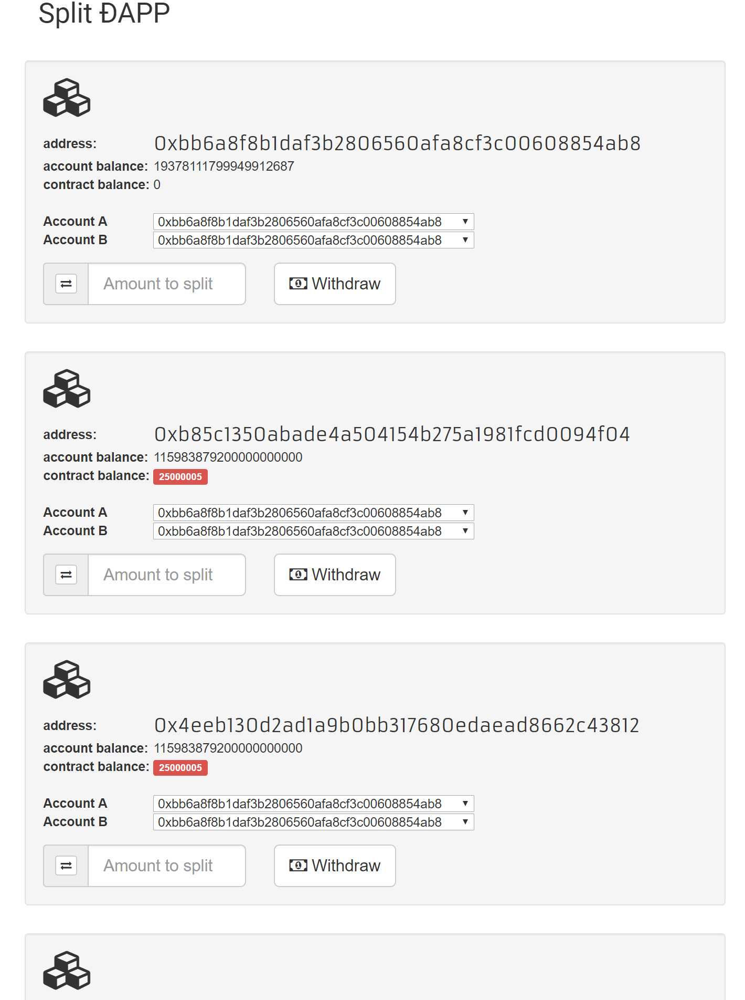

Simple decentralized application based on a Solidity smart contract that splits a deposit and distributes each half to two beneficiaries. 



## Usage

To distribute funds: 

```javascript
split.distribute(accountA, accountB, {from:eth.coinbase, value:1000000000000000000})
```

To check contract balance: 

```javascript
split.balances.call(accountA)
```

```javascript
split.getAccountBalance(accountA)
```

To withdraw from the contract:

```javascript
split.withdraw({from:accountA})
```
To watch contract events: 

```javascript
var splitAddress = "<address>";
var split = web3.eth.contract(splitCompiled.Split.info.abiDefinition).at(splitAddress);

split.Distributed().watch(function(error, result){
    if(error){
        console.log(error);
    } else {
        console.log('Funds distributed: ' + JSON.stringify(result.args));
    }
});

split.BalanceWithdrawn().watch(function(error, result){
    if(error){
        console.log(error);
    } else {
        console.log('Withdrawal event: ' + JSON.stringify(result.args));
    }
});
```


